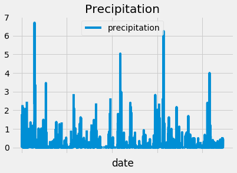
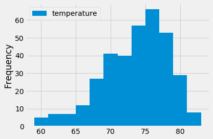
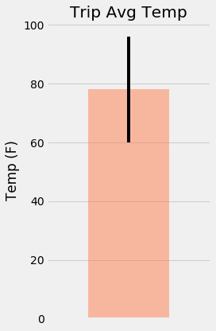

```python
%matplotlib inline
from matplotlib import style
style.use('fivethirtyeight')
import matplotlib.pyplot as plt
```


```python
import numpy as np
import pandas as pd
```


```python
import datetime as dt
```

# Reflect Tables into SQLAlchemy ORM


```python
# Python SQL toolkit and Object Relational Mapper
import sqlalchemy
from sqlalchemy.ext.automap import automap_base
from sqlalchemy.orm import Session
from sqlalchemy import create_engine, func
```


```python
engine = create_engine("sqlite:///Resources/hawaii.sqlite")
```


```python
# reflect an existing database into a new model
Base = automap_base()
# reflect the tables
Base.prepare(engine, reflect=True)
```


```python
# We can view all of the classes that automap found
Base.classes.keys()
```


    ['measurement', 'station']


```python
# Save references to each table
Measurement = Base.classes.measurement
Station = Base.classes.station
```


```python
# Create our session (link) from Python to the DB
session = Session(engine)
```

# Exploratory Climate Analysis


```python
# Design a query to retrieve the last 12 months of precipitation data and plot the results
max_date = session.query(Measurement.date).order_by(Measurement.date.desc()).first()
max_date = max_date[0]

print(max_date)

# Calculate the date 1 year ago from the last data point in the database
past_yr = dt.datetime.strptime(max_date, "%Y-%m-%d") - dt.timedelta(days=366)
print(past_yr)

# Perform a query to retrieve the data and precipitation scores
query = session.query(Measurement.date, Measurement.prcp).filter(Measurement.date >= past_yr).all()
# print(query)

# Save the query results as a Pandas DataFrame and set the index to the date column
dataframe = pd.DataFrame(query,columns=['date', 'precipitation'])
dataframe.set_index('date', inplace=True)
print(dataframe)


# Sort the dataframe by date
dataframe = dataframe.sort_values(by='date',ascending=True)
print(dataframe)


```

    2017-08-23
    2016-08-22 00:00:00
                precipitation
    date                     
    2016-08-23           0.00
    2016-08-24           0.08
    2016-08-25           0.08
    2016-08-26           0.00
    2016-08-27           0.00
    2016-08-28           0.01
    2016-08-29           0.00
    2016-08-30           0.00
    2016-08-31           0.13
    2016-09-01           0.00
    2016-09-02           0.00
    2016-09-03           0.00
    2016-09-04           0.03
    2016-09-05            NaN
    2016-09-06            NaN
    2016-09-07           0.05
    2016-09-08           0.00
    2016-09-09           0.03
    2016-09-10           0.00
    2016-09-11           0.05
    2016-09-12           0.00
    2016-09-13           0.02
    2016-09-14           1.32
    2016-09-15           0.42
    2016-09-16           0.06
    2016-09-17           0.05
    2016-09-18           0.00
    2016-09-19           0.00
    2016-09-20           0.00
    2016-09-21           0.00
    ...                   ...
    2017-07-24           0.84
    2017-07-25           0.30
    2017-07-26           0.30
    2017-07-27           0.00
    2017-07-28           0.40
    2017-07-29           0.30
    2017-07-30           0.30
    2017-07-31           0.00
    2017-08-01            NaN
    2017-08-02           0.25
    2017-08-03           0.06
    2017-08-05            NaN
    2017-08-06            NaN
    2017-08-07           0.05
    2017-08-08           0.34
    2017-08-09           0.15
    2017-08-10           0.07
    2017-08-11            NaN
    2017-08-12           0.14
    2017-08-13            NaN
    2017-08-14           0.22
    2017-08-15           0.42
    2017-08-16           0.42
    2017-08-17           0.13
    2017-08-18            NaN
    2017-08-19           0.09
    2017-08-20            NaN
    2017-08-21           0.56
    2017-08-22           0.50
    2017-08-23           0.45
    
    [2230 rows x 1 columns]
                precipitation
    date                     
    2016-08-23           0.00
    2016-08-23            NaN
    2016-08-23           1.79
    2016-08-23           0.05
    2016-08-23           0.15
    2016-08-23           0.70
    2016-08-23           0.02
    2016-08-24           0.08
    2016-08-24           2.15
    2016-08-24           2.28
    2016-08-24            NaN
    2016-08-24           1.45
    2016-08-24           1.22
    2016-08-24           2.15
    2016-08-25           0.08
    2016-08-25           0.00
    2016-08-25           0.21
    2016-08-25           0.06
    2016-08-25           0.00
    2016-08-25           0.11
    2016-08-25           0.08
    2016-08-26           0.03
    2016-08-26           0.01
    2016-08-26           0.00
    2016-08-26           0.04
    2016-08-26           0.02
    2016-08-26           0.00
    2016-08-27           0.18
    2016-08-27           0.12
    2016-08-27           0.00
    ...                   ...
    2017-08-16           0.42
    2017-08-16           0.12
    2017-08-16           0.07
    2017-08-16           0.00
    2017-08-17           0.13
    2017-08-17           0.01
    2017-08-17           0.00
    2017-08-17           0.05
    2017-08-18            NaN
    2017-08-18           0.06
    2017-08-18           0.00
    2017-08-18           0.00
    2017-08-19           0.00
    2017-08-19           0.09
    2017-08-19            NaN
    2017-08-19           0.00
    2017-08-20           0.00
    2017-08-20           0.01
    2017-08-20            NaN
    2017-08-21           0.56
    2017-08-21           0.02
    2017-08-21           0.00
    2017-08-21            NaN
    2017-08-22           0.00
    2017-08-22           0.50
    2017-08-22           0.00
    2017-08-23           0.00
    2017-08-23           0.00
    2017-08-23           0.08
    2017-08-23           0.45
    
    [2230 rows x 1 columns]


```python
# Use Pandas Plotting with Matplotlib to plot the data
dataframe.plot(title="Precipitation")
plt.legend(loc='upper center')
plt.savefig("Precipitation.png")
plt.show()
```





```python
# Use Pandas to calcualte the summary statistics for the precipitation data
dataframe.describe()
```


<div>
<style scoped>
    .dataframe tbody tr th:only-of-type {
        vertical-align: middle;
    }

    .dataframe tbody tr th {
        vertical-align: top;
    }

    .dataframe thead th {
        text-align: right;
    }
</style>
<table border="1" class="dataframe">
  <thead>
    <tr style="text-align: right;">
      <th></th>
      <th>precipitation</th>
    </tr>
  </thead>
  <tbody>
    <tr>
      <th>count</th>
      <td>2021.000000</td>
    </tr>
    <tr>
      <th>mean</th>
      <td>0.177279</td>
    </tr>
    <tr>
      <th>std</th>
      <td>0.461190</td>
    </tr>
    <tr>
      <th>min</th>
      <td>0.000000</td>
    </tr>
    <tr>
      <th>25%</th>
      <td>0.000000</td>
    </tr>
    <tr>
      <th>50%</th>
      <td>0.020000</td>
    </tr>
    <tr>
      <th>75%</th>
      <td>0.130000</td>
    </tr>
    <tr>
      <th>max</th>
      <td>6.700000</td>
    </tr>
  </tbody>
</table>
</div>


```python
# Design a query to show how many stations are available in this dataset?
stations = session.query(Measurement.station).distinct().count()
print(stations)
```

    9


```python
# What are the most active stations? (i.e. what stations have the most rows)?
# List the stations and the counts in descending order.
active_stations = session.query(Measurement.station, func.count(Measurement.station)).group_by(Measurement.station).order_by(func.count(Measurement.station).desc()).all()
active_stations
```


    [('USC00519281', 2772),
     ('USC00519397', 2724),
     ('USC00513117', 2709),
     ('USC00519523', 2669),
     ('USC00516128', 2612),
     ('USC00514830', 2202),
     ('USC00511918', 1979),
     ('USC00517948', 1372),
     ('USC00518838', 511)]


```python
# Using the station id from the previous query, calculate the lowest temperature recorded, 
# highest temperature recorded, and average temperature most active station?
active_station_id = active_stations[0][0]
print(active_station_id)

most_active_temps = session.query(func.min(Measurement.tobs), func.max(Measurement.tobs),func.avg(Measurement.tobs)).filter(Measurement.station == active_station_id).all()
print(f"Low: {most_active_temps[0][0]} High: {most_active_temps[0][1]} Average: {round(most_active_temps[0][2], 1)}")


```

    USC00519281
    Low: 54.0 High: 85.0 Average: 71.7


```python
# Choose the station with the highest number of temperature observations.
# Query the last 12 months of temperature observation data for this station and plot the results as a histogram
high_num_temps = session.query(Measurement.station, func.count(Measurement.tobs)).group_by(Measurement.station).order_by(func.count(Measurement.station).desc()).first()
high_num_temps= high_num_temps[0]
print(high_num_temps)

temperature_observations = session.query( Measurement.tobs).filter(Measurement.date >= year_ago).filter(Measurement.station == high_num_temps).all()
temperature_observations = pd.DataFrame(temperature_observations, columns=['temperature'])
print(temperature_observations)

```

    USC00519281
         temperature
    0           77.0
    1           77.0
    2           80.0
    3           80.0
    4           75.0
    5           73.0
    6           78.0
    7           77.0
    8           78.0
    9           80.0
    10          80.0
    11          78.0
    12          78.0
    13          78.0
    14          73.0
    15          74.0
    16          80.0
    17          79.0
    18          77.0
    19          80.0
    20          76.0
    21          79.0
    22          75.0
    23          79.0
    24          78.0
    25          79.0
    26          78.0
    27          78.0
    28          76.0
    29          74.0
    ..           ...
    322         72.0
    323         74.0
    324         74.0
    325         76.0
    326         80.0
    327         80.0
    328         76.0
    329         76.0
    330         76.0
    331         77.0
    332         77.0
    333         77.0
    334         82.0
    335         75.0
    336         77.0
    337         75.0
    338         76.0
    339         81.0
    340         82.0
    341         81.0
    342         76.0
    343         77.0
    344         82.0
    345         83.0
    346         77.0
    347         77.0
    348         77.0
    349         76.0
    350         76.0
    351         79.0
    
    [352 rows x 1 columns]


```python
temperature_observations.plot.hist(bins=12)
plt.tight_layout()
plt.savefig("tobshistogram.png")
plt.show()
```





```python
# This function called `calc_temps` will accept start date and end date in the format '%Y-%m-%d' 
# and return the minimum, average, and maximum temperatures for that range of dates
def calc_temps(start_date, end_date):
    """TMIN, TAVG, and TMAX for a list of dates.
    
    Args:
        start_date (string): A date string in the format %Y-%m-%d
        end_date (string): A date string in the format %Y-%m-%d
        
    Returns:
        TMIN, TAVE, and TMAX
    """
    
    return session.query(func.min(Measurement.tobs), func.avg(Measurement.tobs), func.max(Measurement.tobs)).\
        filter(Measurement.date >= start_date).filter(Measurement.date <= end_date).all()

# function usage example
print(calc_temps('2012-02-28', '2012-03-05'))
```

    [(62.0, 69.57142857142857, 74.0)]


```python
# Use your previous function `calc_temps` to calculate the tmin, tavg, and tmax 
# for your trip using the previous year's data for those same dates.
temps = calc_temps('2017-02-28','2017-03-05')
temps
```


    [(64.0, 72.02777777777777, 78.0)]


```python
# Plot the results from your previous query as a bar chart. 
# Use "Trip Avg Temp" as your Title
# Use the average temperature for the y value
# Use the peak-to-peak (tmax-tmin) value as the y error bar (yerr)
temps_df = pd.DataFrame(temps, columns=['tmin', 'tavg', 'tmax'])
temps_df.plot.bar(y='tavg', yerr=(temps_df['tmax'] - temps_df['tmin']), title='Trip Avg Temp', color='coral', alpha=0.5, figsize=(4,6))
plt.xticks(np.arange(1, 1.0))
plt.ylabel("Temp (F)")
plt.tight_layout()
plt.gca().legend_.remove()
plt.savefig("TRIP_AVG_TEMP.png")
plt.show()

```





```python
# Calculate the rainfall per weather station for your trip dates using the previous year's matching dates.
# Sort this in descending order by precipitation amount and list the station, name, latitude, longitude, and elevation
start_date = '2017-02-28'
end_date = '2017-03-05'
    
query2 = session.query(Measurement.station, Station.name, Station.latitude, Station.longitude, Station.elevation, Measurement.prcp).filter(Measurement.station == Station.station).filter(Measurement.date >= start_date).filter(Measurement.date <= end_date).group_by(Measurement.station).order_by(Measurement.prcp.desc()).all()
print(query2)


```

    [('USC00516128', 'MANOA LYON ARBO 785.2, HI US', 21.3331, -157.8025, 152.4, 0.58), ('USC00513117', 'KANEOHE 838.1, HI US', 21.4234, -157.8015, 14.6, 0.16), ('USC00514830', 'KUALOA RANCH HEADQUARTERS 886.9, HI US', 21.5213, -157.8374, 7.0, 0.04), ('USC00519281', 'WAIHEE 837.5, HI US', 21.45167, -157.84888999999998, 32.9, 0.04), ('USC00519397', 'WAIKIKI 717.2, HI US', 21.2716, -157.8168, 3.0, 0.0), ('USC00519523', 'WAIMANALO EXPERIMENTAL FARM, HI US', 21.33556, -157.71139, 19.5, 0.0), ('USC00517948', 'PEARL CITY, HI US', 21.3934, -157.9751, 11.9, None)]


## Optional Challenge Assignment


```python
# Create a query that will calculate the daily normals 
# (i.e. the averages for tmin, tmax, and tavg for all historic data matching a specific month and day)

def daily_normals(date):
    """Daily Normals.
    
    Args:
        date (str): A date string in the format '%m-%d'
        
    Returns:
        A list of tuples containing the daily normals, tmin, tavg, and tmax
    
    """
    
    sel = [func.min(Measurement.tobs), func.avg(Measurement.tobs), func.max(Measurement.tobs)]
    return session.query(*sel).filter(func.strftime("%m-%d", Measurement.date) == date).all()
    
daily_normals("01-01")
```


    [(62.0, 69.15384615384616, 77.0)]


```python
# calculate the daily normals for your trip
# push each tuple of calculations into a list called `normals`

# Set the start and end date of the trip
start_date = '2017-02-28'
end_date = '2017-03-05'

# Use the start and end date to create a range of dates
dates = session.query(Measurement.date).filter(Measurement.date >= start_date).filter(Measurement.date <= end_date).group_by(Measurement.date).all()
dates
trip_dates = [x[0] for x in dates]
trip_dates

# Stip off the year and save a list of %m-%d strings with another list comprehension 
dates_stripped= [x[5:] for x in trip_dates]
dates

# Find the start month/day and the end month/day 
start_month_day = trip_dates_stripped[0]
end_month_day = trip_dates_stripped[-1]


```


    [(65.0, 70.65517241379311, 80.0),
     (67.0, 71.73333333333333, 79.0),
     (64.0, 70.0327868852459, 76.0),
     (61.0, 70.36666666666666, 78.0),
     (60.0, 70.06896551724138, 78.0),
     (57.0, 69.27272727272727, 77.0),
     (60.0, 67.89090909090909, 76.0)]


